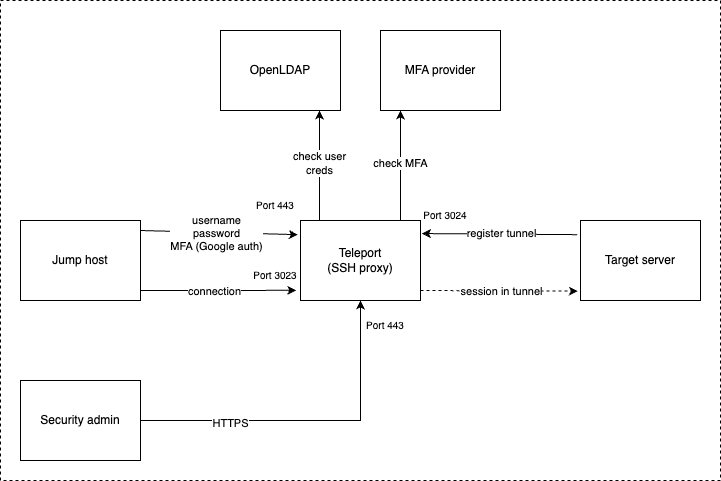

# Teleport PoC Setup Guide

**Debian 13 + Docker Compose + Self‑Signed TLS (Lab Mode)**

------------------------------------------------------------------------



Demo Video

[Watch the demo on YouTube](https://youtu.be/Q92DtG8OltY)

## Infrastructure

  IP                Role
  ----------------- -----------------------
  172.236.193.19    Teleport Auth + Proxy
  172.236.193.212   Target Node
  172.238.122.135   Client (tsh)

Public DNS used:

    172-236-193-19.ip.linodeusercontent.com

------------------------------------------------------------------------

# Install Docker (Teleport Server)

On **172.236.193.19**:

``` bash
apt update
apt install -y docker.io docker-compose
systemctl enable docker
systemctl start docker
```

------------------------------------------------------------------------

# Create Teleport Config

``` bash
mkdir -p /opt/teleport/config
cd /opt/teleport
vi config/teleport.yaml
```

Paste:

``` yaml
version: v3

teleport:
  nodename: teleport
  data_dir: /var/lib/teleport
  log:
    output: stderr
    severity: INFO

auth_service:
  enabled: true
  cluster_name: 172-236-193-19.ip.linodeusercontent.com

ssh_service:
  enabled: false

proxy_service:
  enabled: true
  web_listen_addr: 0.0.0.0:443
  public_addr: 172-236-193-19.ip.linodeusercontent.com:443
  listen_addr: 0.0.0.0:3023
  tunnel_listen_addr: 0.0.0.0:3024
  tunnel_public_addr: 172-236-193-19.ip.linodeusercontent.com:3024
```

------------------------------------------------------------------------

# Docker Compose File

``` bash
vi docker-compose.yml
```

``` yaml
version: "3.8"

services:
  teleport:
    image: public.ecr.aws/gravitational/teleport:14.4.1
    container_name: teleport
    hostname: 172-236-193-19.ip.linodeusercontent.com
    restart: unless-stopped
    volumes:
      - ./config:/etc/teleport
      - teleport-data:/var/lib/teleport
    ports:
      - "443:443"
      - "3023:3023"
      - "3024:3024"
    command: ["--config=/etc/teleport/teleport.yaml"]

volumes:
  teleport-data:
```

------------------------------------------------------------------------

# Start Teleport

``` bash
docker-compose up -d
docker logs -f teleport
```

Ensure no errors.

------------------------------------------------------------------------

# Create Admin User

``` bash
docker exec -it teleport tctl users add admin --roles=editor,access
```

Open the invite link and configure password + MFA.

------------------------------------------------------------------------

# Install tsh on Client (172.238.122.135)

``` bash
curl https://goteleport.com/static/install.sh | bash -s 14.4.1
```

Login (lab mode self-signed TLS):

``` bash
tsh login --proxy=172-236-193-19.ip.linodeusercontent.com --user=admin --insecure
```

------------------------------------------------------------------------

# Create Full Access Role (Allow root + admin)

On Teleport server:

``` bash
docker exec -i teleport tctl create <<EOF
kind: role
version: v6
metadata:
  name: full-access
spec:
  allow:
    logins: ["root", "admin"]
    node_labels:
      "*": "*"
EOF
```

Assign role:

``` bash
docker exec -it teleport tctl users update admin --set-roles=editor,full-access
```

Client must re-login:

``` bash
tsh logout
tsh login --proxy=172-236-193-19.ip.linodeusercontent.com --user=admin --insecure
```

------------------------------------------------------------------------

# Install Teleport on Target (172.236.193.212)

``` bash
curl https://goteleport.com/static/install.sh | bash -s 14.4.1
```

------------------------------------------------------------------------

# Create Node Join Token

``` bash
docker exec -it teleport tctl tokens add --type=node
```

Copy token and ca-pin.

------------------------------------------------------------------------

# Join Node (Lab Mode)

On target:

``` bash
sudo teleport start   --roles=node   --token=YOUR_TOKEN   --ca-pin=YOUR_CA_PIN   --auth-server=172-236-193-19.ip.linodeusercontent.com:443   --insecure
```

------------------------------------------------------------------------

# Verify from Client

``` bash
tsh ls
```

SSH:

``` bash
tsh ssh root@localhost
```

or

``` bash
tsh ssh admin@localhost
```

------------------------------------------------------------------------

# What This Setup Provides

-   Teleport Auth + Proxy via Docker
-   Reverse tunnel node join
-   Self-signed TLS (lab mode)
-   RBAC role allowing root/admin
-   Short-lived SSH certificates
-   No authorized_keys needed

------------------------------------------------------------------------

# Production Notes

For production: - Use real domain + Let's Encrypt - Remove
`--insecure` - Use systemd instead of foreground node - Configure proper
RBAC roles - Enable audit log backend

------------------------------------------------------------------------

End of Guide.
