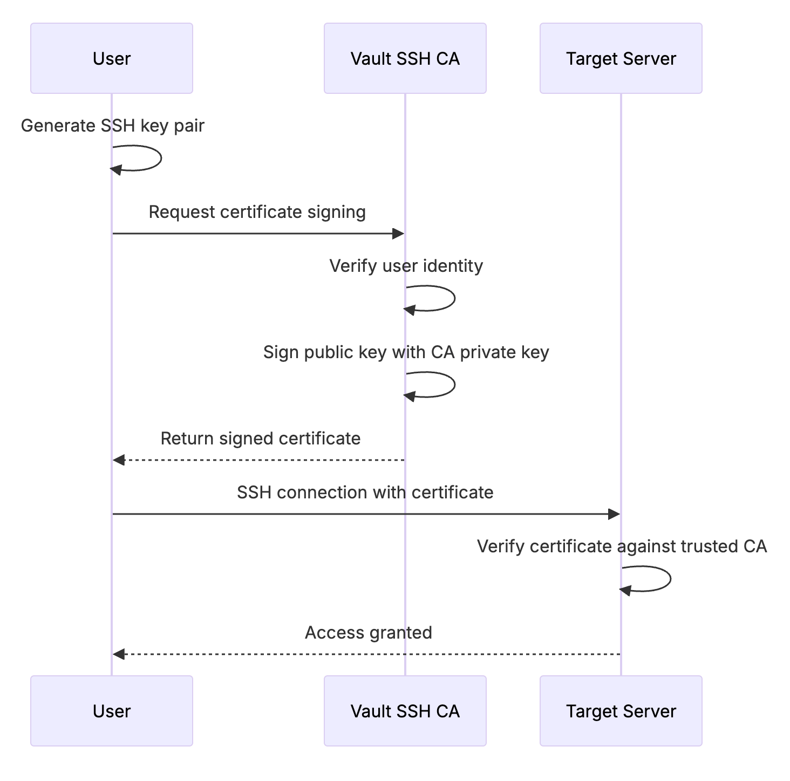

# VAULT SSH CA LAB -- FULL STEP-BY-STEP GUIDE

## Goal

Implement temporary SSH access to Linux servers using **Vault as an SSH
Certificate Authority (CA)**.\
Issued SSH certificates will be valid for a short period (TTL = 30
minutes in this lab).

This removes the need for static `authorized_keys` management.



------------------------------------------------------------------------

## Infrastructure

| Role            | IP               |
|-----------------|------------------|
| Vault Server   | 172.236.193.139  |
| Target Server  | 172.236.193.212  |
| Client         | 172.238.122.135  |

------------------------------------------------------------------------

# STEP 1 -- INSTALL VAULT (ON 172.236.193.139)

Vault will act as the SSH Certificate Authority.

``` bash
apt update
apt install -y wget unzip

wget https://releases.hashicorp.com/vault/1.15.6/vault_1.15.6_linux_amd64.zip
unzip vault_1.15.6_linux_amd64.zip
mv vault /usr/local/bin/

vault version
```

At this stage, Vault binary is installed and ready.

------------------------------------------------------------------------

# STEP 2 -- START VAULT IN DEV MODE (LAB ONLY)

⚠ This is for lab/testing only. Dev mode is NOT for production.

``` bash
vault server -dev \
  -dev-root-token-id=root \
  -dev-listen-address=0.0.0.0:8200
```

Important: - Keep this terminal running. - Vault runs in-memory. - You
will see:

    Root Token: root

------------------------------------------------------------------------

# STEP 3 -- LOGIN TO VAULT (NEW TERMINAL)

Open a new terminal and authenticate.

``` bash
export VAULT_ADDR=http://127.0.0.1:8200
vault login root
```

Now you are authenticated to Vault.

------------------------------------------------------------------------

# STEP 4 -- ENABLE SSH SECRETS ENGINE

This enables Vault's SSH Certificate Authority functionality.

``` bash
vault secrets enable ssh
```

Vault is now ready to issue SSH certificates.

------------------------------------------------------------------------

# STEP 5 -- GENERATE CA KEY INSIDE VAULT

Vault must generate its internal SSH CA key pair.

``` bash
vault write ssh/config/ca generate_signing_key=true
```

What happens here:

-   Vault generates a private signing key (stored securely inside Vault)
-   Vault generates a public key (to distribute to servers)
-   Vault is now officially an SSH CA

------------------------------------------------------------------------

# STEP 6 -- CREATE ROLE WITH 30 MINUTE TTL

This defines who can get certificates and under what rules.

``` bash
vault write ssh/roles/dev-role -<<EOH
{
  "key_type": "ca",
  "allow_user_certificates": true,
  "default_user": "root",
  "allowed_users": "root,deploy,app",
  "allowed_extensions": "permit-pty,permit-agent-forwarding",
  "default_extensions": {
    "permit-pty": ""
  },
  "ttl": "30m"
}
EOH
```

What this does:

-   Allows user certificates
-   Permits login as root, deploy, app
-   Enables PTY allocation
-   Sets certificate TTL to 30 minutes

------------------------------------------------------------------------

# STEP 7 -- CONFIGURE TARGET SERVER TO TRUST VAULT CA

Now we make the target server trust Vault's public key.

## On Vault server:

``` bash
vault read -field=public_key ssh/config/ca > ca.pub
```

## Copy CA public key to target:

``` bash
scp ca.pub root@172.236.193.212:/etc/ssh/ca.pub
```

## On Target server:

``` bash
echo "TrustedUserCAKeys /etc/ssh/ca.pub" >> /etc/ssh/sshd_config
systemctl restart ssh
```

What happens:

-   Target now trusts any certificate signed by Vault CA.
-   No authorized_keys entries required.

------------------------------------------------------------------------

# STEP 8 -- GENERATE SSH KEY ON CLIENT

On Client (172.238.122.135):

``` bash
ssh-keygen -t ed25519 -f id_ed25519
```

This creates:

-   id_ed25519 (private key)
-   id_ed25519.pub (public key)

------------------------------------------------------------------------

# STEP 9 -- SIGN CLIENT PUBLIC KEY USING VAULT

## Copy public key to Vault:

``` bash
scp id_ed25519.pub root@172.236.193.139:/root/
```

## On Vault server:

``` bash
vault write -field=signed_key ssh/sign/dev-role public_key=@/root/id_ed25519.pub > /root/id_ed25519-cert.pub
```

## Verify certificate:

``` bash
ssh-keygen -L -f /root/id_ed25519-cert.pub
```

You will see:

-   Valid principals
-   Validity period (30m)
-   Signing CA fingerprint

## Return signed certificate to client:

``` bash
scp /root/id_ed25519-cert.pub root@172.238.122.135:/root/
```

------------------------------------------------------------------------

# STEP 10 -- LOGIN USING TEMPORARY CERTIFICATE

On Client:

``` bash
ssh -i id_ed25519 root@172.236.193.212
```

OpenSSH automatically uses:

-   id_ed25519
-   id_ed25519-cert.pub

Login should succeed.

------------------------------------------------------------------------

## Verify certificate validity:

``` bash
ssh-keygen -L -f id_ed25519-cert.pub
```

After TTL expires (30 minutes):

``` bash
ssh -i id_ed25519 root@172.236.193.212
```

Access will fail with certificate expired.

------------------------------------------------------------------------

# ARCHITECTURE SUMMARY

    Client → Vault (signs key, TTL=30m)
    Client → Target (SSH certificate authentication)
    Target trusts Vault CA via TrustedUserCAKeys

------------------------------------------------------------------------

# WHAT THIS ACHIEVES

✔ No static authorized_keys\
✔ Short-lived credentials\
✔ Centralized certificate authority\
✔ Automatic expiration\
✔ Fully open-source solution

------------------------------------------------------------------------

END OF GUIDE
